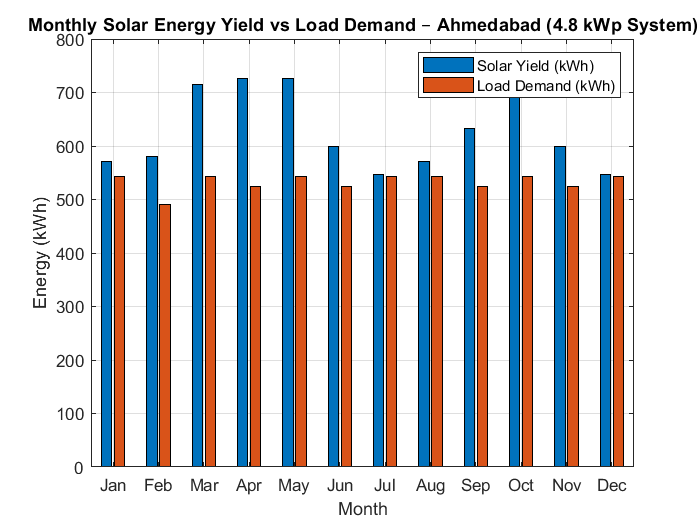
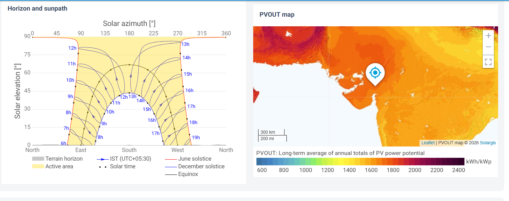

# Solar PV System Sizing and Energy Yield Estimation

> Renewable Energy Systems | MATLAB | Microsoft Excel | Off-Grid Design

## Overview

This project designs a complete off-grid solar PV system for a
17.5 kWh/day commercial load located in Ahmedabad, Gujarat.
It covers load analysis, system sizing, and monthly energy
yield simulation — replicating the preliminary design workflow
used in real solar engineering projects.

---

## System Specifications

| Parameter | Value |
|---|---|
| Location | Ahmedabad, Gujarat |
| Daily Load | 17.5 kWh/day |
| Installed Capacity | 4.8 kWp (12 × 400W panels) |
| Inverter Size | 2.5 kVA |
| Battery Bank | 8 × 100 Ah at 48V |
| System Efficiency (PR) | 80% |
| Design PSH (worst month) | 4.8 hrs/day (January) |

---

## Methodology

### Step 1 — Load Assessment
Defined appliance-wise daily energy consumption:
- 20 LED lights × 20W × 10 hrs = 4,000 Wh
- 10 ceiling fans × 75W × 10 hrs = 7,500 Wh
- 5 computers × 150W × 8 hrs = 6,000 Wh
- **Total: 17,500 Wh/day**

### Step 2 — Solar Resource Data
Monthly average PSH values for Ahmedabad sourced from
[Global Solar Atlas](https://globalsolaratlas.info).
Range: 4.6 (December) to 6.3 (April).

### Step 3 — System Sizing Formulas

**Panels:**
N = Daily Load (Wh) / (Panel Wattage × PSH × System Efficiency)
N = 17500 / (400 × 4.8 × 0.80) = 11.4 → 12 panels
**Inverter:**
Peak Load = 1,900 W
Inverter = 1900 × 1.25 = 2,375 W → 2.5 kVA
**Battery:**
Capacity = Daily Load / (Bus Voltage × DOD)
= 17500 / (48 × 0.50) = 729 Ah → 8 × 100 Ah

### Step 4 — Monthly Energy Yield
Monthly Yield = Panels × Panel kW × PSH × Days × PR
Simulated for all 12 months. Annual yield: ~6,500 kWh.

## Outputs

### Monthly Yield vs Demand Chart (MATLAB)

### Gujarat Solar Data

## Key Results

- **Annual Solar Yield:** ~6,500 kWh
- **Annual Load Demand:** ~6,388 kWh
- **Annual Surplus:** ~112 kWh (suitable for grid export if on-grid)
- **Specific Yield:** ~1,354 kWh/kWp/year
- **Estimated System Cost:** ₹2,16,000 (@ ₹45,000/kWp)
- **Simple Payback Period:** ~5.1 years (@ ₹6/unit tariff)

---

## Tools Used

| Tool | Purpose |
|---|---|
| MATLAB | Monthly yield simulation, bar chart |
| Microsoft Excel | Load calculator, sizing tool, yield report |
| Global Solar Atlas | Irradiation / PSH data source |

---

## Concepts Demonstrated

- Peak Sun Hours (PSH) and Performance Ratio (PR)
- Off-grid system sizing: panels, inverter, battery bank
- Depth of Discharge (DOD) and battery capacity calculation
- Seasonal energy yield variation
- Excel dynamic linking across sheets using named ranges

---

## How to Run

1. Open `matlab/solar_sizing.m` in MATLAB
2. Run the script — bar chart and sizing summary will generate
3. Open `excel/Solar_Sizing_Tool.xlsx`
4. Modify appliance values in Sheet 1 (Load Calculator)
5. Sizing results update automatically in Sheet 2
6. Monthly yield report and chart visible in Sheet 3
